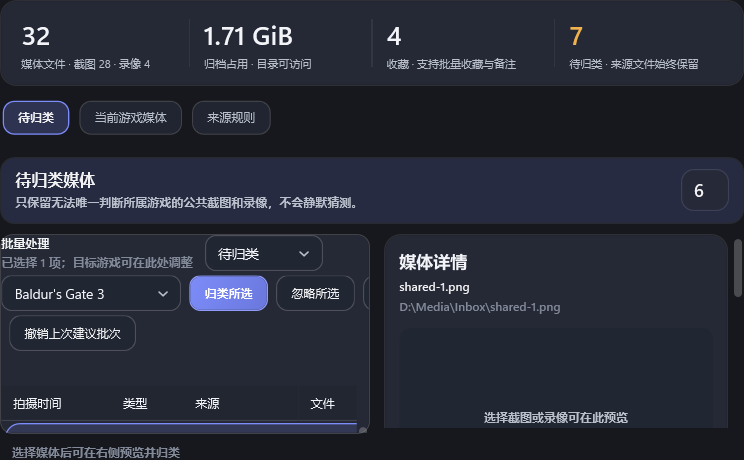
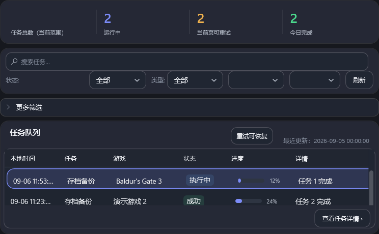
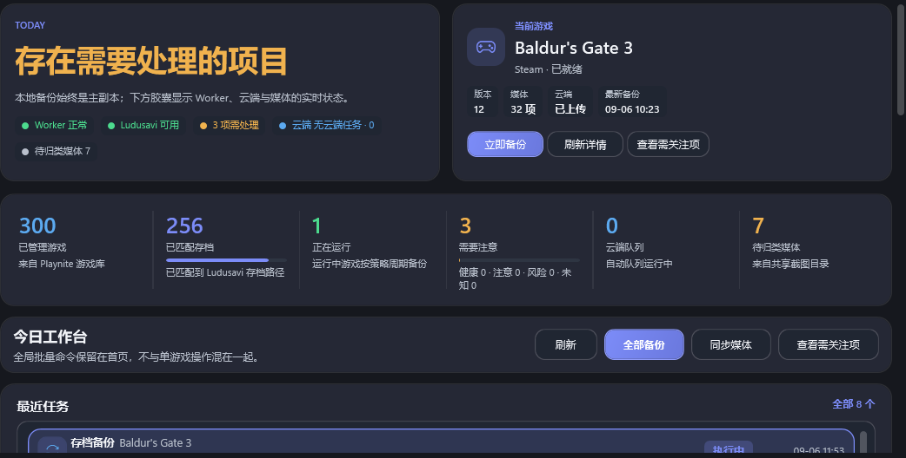
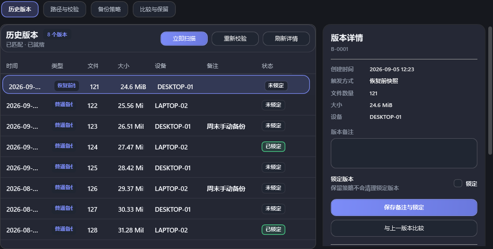
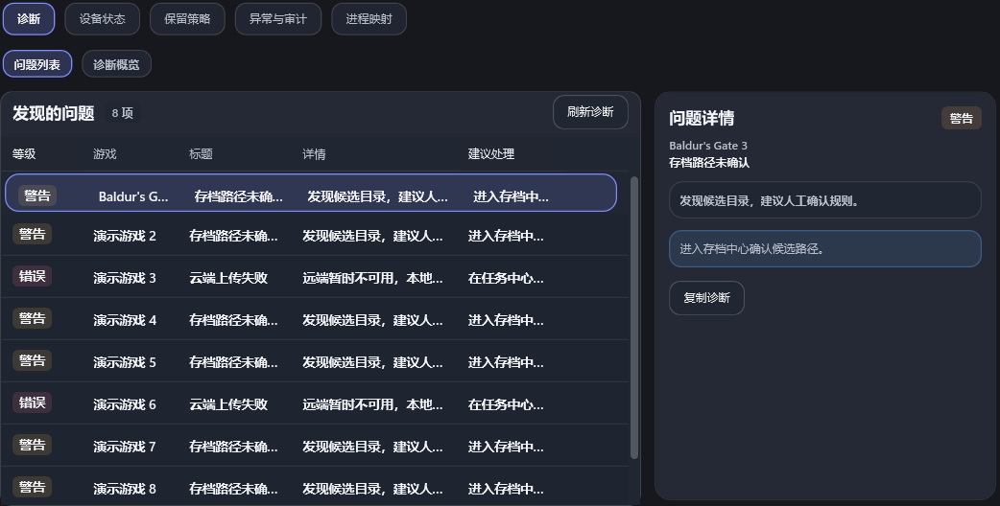

# Luna 实现复查与可见 UI 优化方案

审阅基线：`0ac0e39`，版本 0.6.73，2026-09-06。延续本会话“审阅并更新文档”的范围，本次没有修改业务/XAML、升级版本或安装插件。下列任务尚未实施。

## 本轮判断

V2-01～V2-07 已有对应实现和测试。抽查确认：归类提交加入 SQLite 事务及文件操作账本；巡检争锁有退避并提前保存候选；请求重放核对协议和负载；远端校验区分 Verify/Upload 并用操作 ID 收尾；云队列先聚合再分页；媒体缓存有界。没有在这轮抽查中确认一个需要阻止所有 UI 工作的新 P0 问题，但这不是全路径无缺陷保证。

现在更值得做的是：**让已完成的能力在界面里可访问，并解决常用窗口下按钮与列表争空间的问题**。建议按 UI3-00/01 → UI3-02/03 → UI3-04/05 → UI3-06/07 推进。先做媒体页和云队列，用户最容易感受到变化；不要继续只增加后端接口。

本轮使用生产 WPF 页面和 RenderHarness 重新渲染；工具结果为 `render-qa OK`，但人工审图仍发现可用视口不足。报告成功表示既有自动探针通过，不能抵消截图问题。所有截图是合成数据/离屏证据，不是 Playnite 真机，不是新界面设计稿。

## 本轮证据怎么读

- [原始渲染报告](../design/reviews/2026-09-06-v3/render-qa-report.txt) 随文档保留；截图没有修改或画图遮盖。
- 文件名为外层夹具尺寸。`RenderHarness.Program.ContentSize` 会扣除估计壳体：1040×700 对应 **744×460** 工作区，1366×768 对应 **1042×528**，不能称图片自身就是 1040×700。
- 该估计仍使用 204/228 DIP 侧栏，而当前生产动画目标为 72/270 DIP；精确宿主几何需 UI3-00 校准，不能把这些尺寸当成真机测量值。
- FakeDashboardData 缺少 TaskTotalCount、TaskHistoryScopeOptions/RangeOptions 等新绑定，以及媒体分页/归类等新状态。截图中的任务总数空白、两个范围框空白首先是夹具缺项证据，**不是已经确认的生产绑定故障**。缺真实图片时的空预览也不是图片加载器故障。

## UI3-01（P1）：媒体收件箱先把按钮和列表放得下

**看到了什么**：在 744×460 工作区中仍保留右侧详情，左侧批量区很窄；目标游戏与连续按钮向右超出可用区，表格只剩表头和极少首行内容。页面有 Grid/Border 裁剪，仅设置 DataGrid.MinHeight=236 并不能保证这 236 DIP 真正可见。

**代码依据**：`Views/MediaCenterView.xaml` 的 MediaInboxBatchActionRow 是 WrapPanel，但里面目标游戏+归类/忽略/生成建议被包成一个水平 StackPanel，父 WrapPanel 无法拆开这个整体。`MediaCenterView.xaml.cs.ApplyResponsiveLayout` 仅 `width < 700` 才堆叠 Inbox Inspector；普通 744 DIP 仍占一列。根 MediaInboxScrollSurface 是裁剪 Grid，不能按旧注释假设它会提供页面滚动。

**实施**：

1. 批量区分为“选中数量/视图”“目标游戏/主动作”“次级动作”三组，以独立 Grid/Wrap 项布局；让按钮组可以重排，不能继续用一个不可拆的水平 StackPanel 包住全部动作。
2. 中窄视口优先给列表宽度；Inspector 可按既有紧凑详情机制切换，按钮显示“查看预览与归类”，关闭后返回原行焦点。断点按真实可用宽度和列表最小宽度计算，不能只机械改 700 为某个数。
3. 长提示默认缩为一句，详细安全说明移到展开区/ToolTip，确认对话仍保留原安全语义。加载统计和加载更多单独放列表页脚，不能挤进批量主动作行。
4. 高度不足时选择一个明确可操作的页面溢出通道，内部列表仍有限视口和 Recycling/Item 滚动；不通过隐藏数据、缩小字体、负 Margin 或整体缩放解决。

**验收**：外层 1040×700、1100×720、1366×768，分别记录实际工作区宽高；至少约 4 行主表完整可读、全部按钮可操作；有 200 项真实形状分页数据、长游戏名、High/Low 建议、批量多选时同样成立；深/浅/Follow、高对比度、DPI、键盘往返。先做这一页并保留前后同夹具截图。

## UI3-02（P1）：把云队列后端接成用户能操作的明细

**源码确认的缺口**：V2-06 的 DTO/SQLite 已有 Page/PageSize/State/Kind；生产 Playnite 搜索结果主要是 Overview 的 CloudTransfers 摘要/ToolTip，没有相应的明细集合、翻页命令或 VerifyCloud 操作入口。维护页也没有云队列明细表。后端支持分页不代表用户现在就能找到第 101 项。

**建议布局**：从首页“云端队列”指标进入维护中的云端区域；顶部为待上传、校验中、需处理计数；下一行为游戏搜索、类型、状态；中间是真实分页列表；右侧详情显示最近错误、下一次尝试、保证等级和相关操作。已有安全重试能复用则复用，不另造任务系统。

**入口**：`CloudTransferDtos`、`MessageTypes.GetCloudTransferStatus`（`cloud.transfer.status`）、`MessageTypes.VerifyCloudTransfer`（`cloud.transfer.verify`）、`CloudTransferStateService`、DashboardViewModel 的维护状态、`MaintenanceView.xaml`、Overview 导航命令。复用这些真实协议，不新增重复消息。

**实现边界**：按页面代际取消读取；选中项由 TransferKey 保持；摘要独立于页码；Verify 只表示远端 check，按钮写清楚范围，备份当前实现校验整个备份根，不能误写成只查单版本。错误类型对应“修改配置/重试上传/重新校验”，不把认证失败自动当成可重试上传。

**验收**：1500+ 条，失败项在后页仍可筛选找到；队列刷新不丢焦点；上传成功与校验成功不同文本；后台暂停与手动操作范围清楚；真实远端验收单列，不用假成功填充 UI。

## UI3-03（P1）：可撤销归类要有可找回的批次入口

**源码事实**：`DashboardViewModel.Media.cs.PreviewMediaClassificationAsync` 在仅生成预览时就把 LastMediaClassificationBatchId 替换成新批次；撤销完成后不论是否有冲突都清空该字段；该字段保存在 ViewModel 内存。后端有持久化批次，但仅凭“撤销上次建议批次”不能保证用户重开页面/新建预览后仍能找到之前已应用批次。

**实施**：分开“当前预览”和“最近可撤销已应用批次”；在媒体页增加轻量批次历史入口，从存储按状态分页查询，展示时间、已应用/冲突/待恢复项、操作结果。部分撤销后仍可查看剩余项，不凭清空一个字符串代表批次关闭。异步预览/应用返回绑定模式和请求代际，切到已忽略时不回写不相关预览。

**验收**：应用 A→生成 B 但不应用→仍可撤销 A；Worker/页面重启后找回；部分冲突有逐项解释；撤销禁用原因可读；文件安全完全复用 V2-01，不从 UI 直接搬文件。此项兼顾可见体验与功能可达性，应早于纯动画。

## UI3-04（P1）：任务页筛选密度与主表高度

**审图结论**：紧凑夹具中摘要、双行筛选、更多筛选和队列标题累计占据大部分高度，主列表只呈现约两行；运行中任务的时间也被截断。截图的空数字/范围框属于前述夹具缺项，先修 UI3-00 再下生产判断。

**实施**：紧凑态把四块统计压成一行状态条或更紧凑的数值/标签布局；保留搜索、状态和刷新作为常用入口，将类型/游戏/范围集中到可展开筛选，并在收起时显示当前生效条件与清除入口。不要隐藏已生效条件。减少重复“刷新/重试”语义，保留单项与批量范围说明。任务时间列用 MM-dd HH:mm 显示、完整时间 Tooltip；列宽按语义优先级调整，不让长详情挤掉时间/状态。

**入口与验收**：TaskCenterView.xaml/.cs 的 TaskFiltersPanel、TaskMoreFiltersExpander、摘要及主表；现有 TaskPageState 沿用。首屏约四行可读、筛选与分页命令真实、已选任务详情可达；宽屏不为了紧凑改法变得空旷。与 UI3-00 合并验收。

## UI3-05（P2）：首页从重复说明改成明确下一步

**看到的现象**：Hero、游戏卡、六项统计、全局动作卡层层叠加，最近任务只在底部露出；“查看需关注项”在游戏卡和全局动作重复，主文案“存在需要处理的项目”没有指出最重要的一件事。“本地备份始终是主副本”“全局批量命令仅保留在首页”等说明更像实现解释。

**实施**：保留 Demo 信息结构，Hero 按真实最高优先级状态显示具体事项与一个主要动作，如“2 个上传等待处理”→“查看云队列”；运行游戏卡只保留当前游戏动作，全局批量操作与当前游戏操作有明确边界；删减重复解释而非删功能，常规统计可收紧，给活动/风险列表增加实际可见空间。健康、无游戏、离线、运行中状态分别设计，不让所有状态都用警告色大标题。

**验收**：文案取真实 DTO，未知状态不伪装健康；计数与点击后的筛选一致；近期活动首屏可读；主页快照刷新不抢用户当前游戏选择。不要将本图合成数据的状态组合当作业务错误。

## UI3-06（P2）：存档与维护详情的可读性和行动入口

**存档**：1366×768 夹具中日期列大量显示 `2026-09-…`，恰好隐藏区分版本最关键的信息；可缩成月日+时分并保留完整 Tooltip。类型/状态列给足宽度，备注弹性。Inspector 把“能否恢复/校验时间/关键风险”置于备注编辑之前，恢复仍按已有预检、确认和 PreRestore 保护流程，不改成一步覆盖。

**维护**：建议处理在表格和详情是文本，主要可见动作只有复制诊断；新增受控的“进入存档路径确认/查看失败任务/打开云队列”导航，不能自动修复所有问题。详情文本可展开，列优先级为等级、游戏、问题，长详情放 Inspector，避免五列同时省略。

**真实文案收口**：`MaintenanceView.xaml` 设备页存在固定“2 台设备共用一个云端仓库”；应绑定实际数量或改为不含数量的说明。`CloudTransferSummaryDto.PrimaryStatusDisplay` 把 CheckFailed/Failed 都写成“上传失败”，应区分“校验失败/上传失败”。归类结果直接拼接内部 State 英文，增加中文展示映射和未知值回退。枚举存储/IPC 值不改，只改显示层。

**验收**：1/2/多设备、仅 check 失败、混合失败、未知新状态；导航传入正确游戏/任务身份；详情滚动后主动作仍可达；无选中时显示明确空状态。此项通过共享模板/显示映射修复，不能复制单页模板绕开主题。

## UI3-07（P2）：缓存窗口翻页与克制动效

V2-07 已实现 2000 项有界窗口，不再把“需要分页/缓存上限”列为新功能；但追加时仍会 Reset，超过容量会 Clear/重新放入保留项并重建索引。成本现在有界，不等于零重建；真实滚动和多选仍需验证。

**实施**：加载更多前捕获可见首项/偏移、选中集合和未保存草稿；加载后恢复锚点，裁掉的窗口有“返回最新/重新载入较新内容”的明确入口。多选跨窗口时定义“仅当前保留项/固定已选 ID”的语义，不能让全选悄悄覆盖已淘汰项。分别测加载第 2 页与第 11 页的滚动/选择，先证明 Reset 影响再优化通知模型。

**动效方向**：页面/Inspector 切换约 120～180ms 淡入加小幅位移，真实完成操作提供局部确认；加载更多保持列表位置，不让所有卡片重新入场。沿用已有减少动画、高对比度与卸载清理。侧栏已有连续点击与性能探针，本轮不再次建议重写；新动效不能掩盖等待或模拟成功。

**验收**：第 11 页跨上限、多选、编辑中加载、快速换模式、关闭动画；位置稳定且可返回新内容。动效实施前先完成 UI3-01～06，截图/录屏需用户能辨别具体交互收益。

## UI3-00（P1，所有 UI 任务的验收依赖）：修正渲染夹具与可见性门禁

本轮 RenderHarness 返回 OK，却可见媒体表格被裁剪、任务只剩少量行。现有探针不足以证明“用户能看到”。另外 FakeDashboardData 缺新增属性，UI 合法 Binding 在离屏时为空；不能以这些空状态修生产代码。

**实施**：

1. 让夹具覆盖 TaskTotalCount、历史范围、分页 HasMore、云队列、巡检、媒体建议与错误状态；绑定错误监听区分生产必要绑定、可选绑定、历史夹具缺项，对必要绑定失败设门禁。
2. 用实际生产 Shell 的 PageHost 布局测量替代过时 ContentSize 常数估算，至少保留一个真正的生产壳嵌套夹具；仍不称为 Playnite 宿主。
3. 判断 DataGrid 的祖先裁剪交集与首/末可见行，而不仅判断 MinHeight/ActualHeight；检查工具栏子项是否落在有效可点击区域，ScrollViewer 若作为可达性证明，必须能滚动到被遮的动作。
4. 保存当前截图作 before，修改后使用相同数据/窗口/主题输出 after；报告列清有数据/空/错误/加载中/分页/多选，不能只渲染“Ready”。

**验收**：先在当前媒体紧凑夹具得到能失败的裁剪断言，再修布局使之通过；任务补齐新字段后没有夹具导致的空选项；生产 Shell 几何、独立页几何分别记录。不得为绿灯把检查改成忽略失败。

## 给下一位 AI 的执行顺序

1. UI3-00 的最小夹具/裁剪检查 + UI3-01 媒体收件箱，一阶段交付并展示 before/after。
2. UI3-02 云队列 + UI3-03 批次历史，各独立提交，确保后端能力通过生产命令可达。
3. UI3-04 任务密度，UI3-05 首页，UI3-06 存档/维护可分别逐页交付。
4. UI3-07 交互锚点与动效最后做。不要一次重写全部页面或更换 UI 框架。

开始时读 CURRENT_STATE 与最新提交，本方案基线之后可能已有更改；先复核，不回滚 Luna 已通过的逻辑。继续 Demo-first；外部 Demo 不在本机时以当前可追溯生产资源和用户已确认例外为基准，不能另造一套视觉规范。UI 质量使用仓库技能，命令/Binding/取消/恢复安全/虚拟化必须保留。

## 本轮验证记录

已执行 RenderHarness 全量离屏渲染，报告 `render-qa OK`，并人工查看媒体、任务、首页、存档、修改器、维护、设置代表截图，含浅/深色任务页。Release 全量构建 0 warning/0 error；Core 65/65，Worker 294 通过/1 跳过，Playnite 341 通过/62 跳过，XAML 19/19；源码校验与 `git diff --check` 通过。跳过项包含 Worker 独立重启、5 项 Named Pipe 行为及 57 项历史 UI 断言，不能计作本轮重新验证通过。

本轮没有新增缺陷复现测试，没有运行真实 Playnite 或云端操作。保留六张代表截图与完整渲染报告到 `docs/design/reviews/2026-09-06-v3/` 作为可跨机器追溯的文档证据；其余本轮临时截图、构建与日志清理。应用代码、版本和安装状态均未改变。
