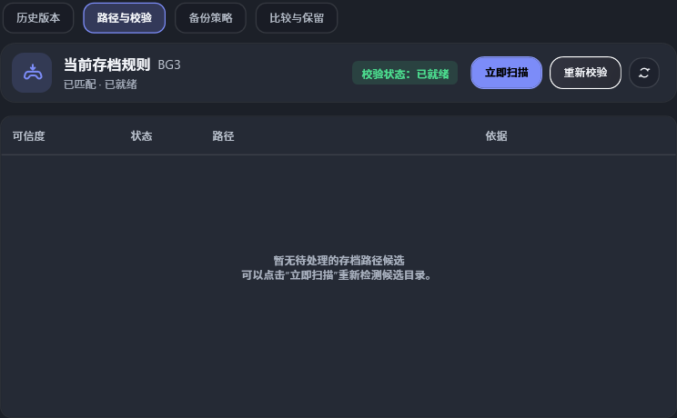
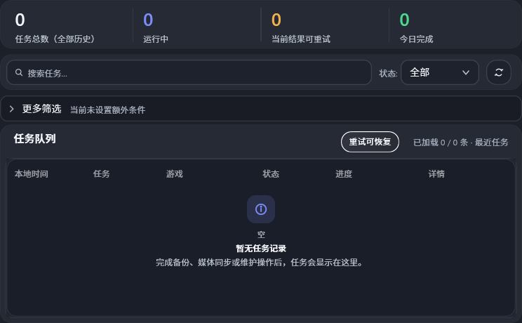
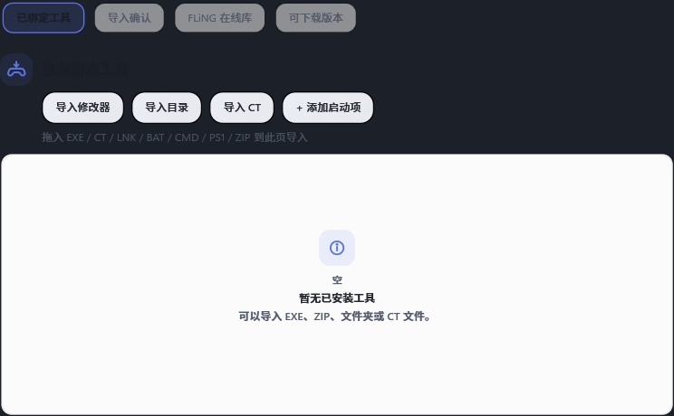
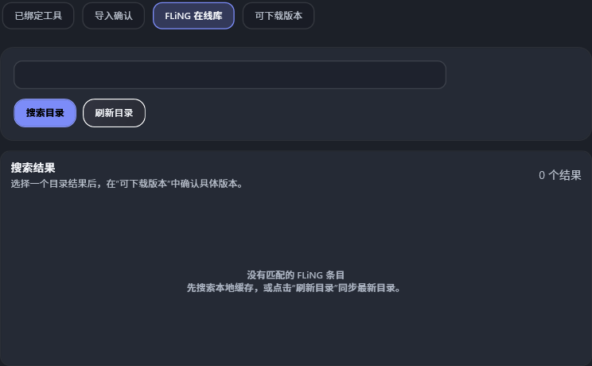
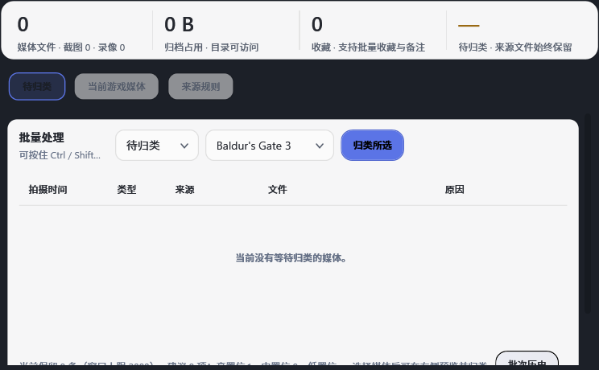
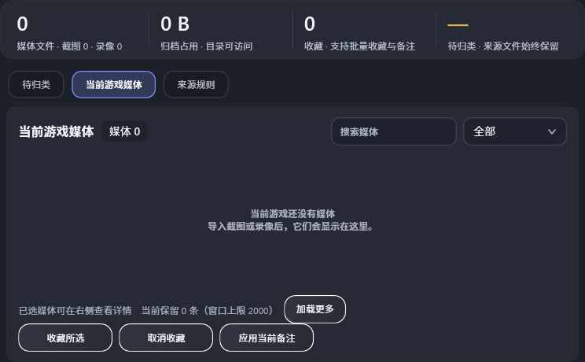
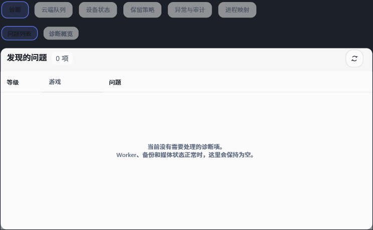
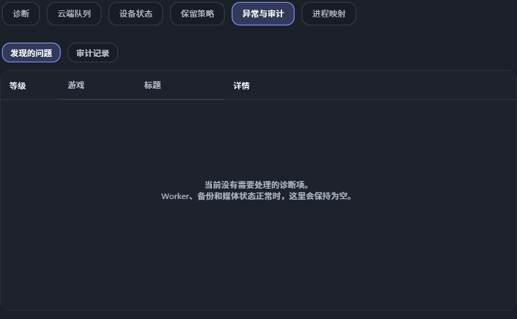
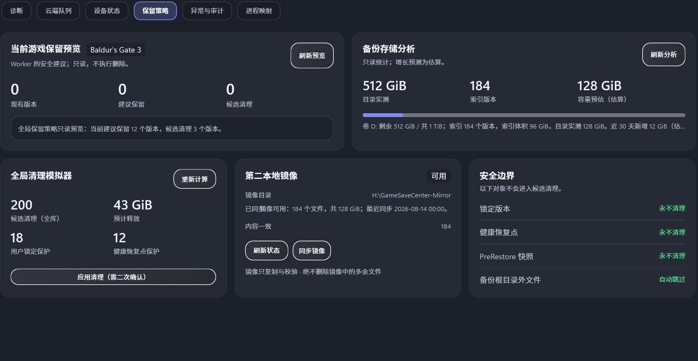

# Q12-08 表格空内容复核

采集日期：2026-09-15（Asia/Shanghai）。代码身份：`77f4dc5d7766751f007621d2db15b66dff2afbd2`（`补充业务空表视觉夹具`）。采集前工作树 clean；生产视图在该提交与前一 clean Release 输出之间无变更。

## 运行与范围

- 使用开发专用 STA direct-reference WPF runner，加载 production views/XAML 和当前 `FakeDashboardData`，不启动 Worker、不读写真实存档；空态数据由 `FakeDashboardData(18, WorkspaceFixtureState.Empty)` 加 `ClearTableDataForFixture()` 提供。
- 覆盖 Light/Dark、逻辑 `1040×700` 与 `1600×900` 窗口尺寸；`emptytables-report.txt` 记录所有遍历页签、表格/列表项目数和可见空态文案。
- 报告结果为 `emptytables OK`：Save 历史/候选、Task、Trainer 工具/在线库/版本、Media 收件箱/当前媒体/来源规则、Maintenance 诊断/云端队列/设备冲突/保留分析/审计/进程映射均未残留数据行或列表项；可见空态文本均被记录。

## 代表截图

浅色 Save 历史、深色 Save 候选：

双主题 Task 空队列：

双主题 Trainer、Media、Maintenance 代表空态：

完整原始报告：[emptytables-report.txt](emptytables-20260915/emptytables-report.txt)。

## 结论与边界

- Q12-08 的离屏视觉列：通过。截图确认空表保留表头/卡片边界，并在内容区给出可读的空态提示；自动报告确认双主题、窄/宽逻辑尺寸下空数据没有残留。
- 本证据不签收真实 Playnite 宿主加载、Worker 实际空结果、Popup/Tooltip、物理 DPI、屏幕读屏或键盘操作；这些仍是宿主边界。
