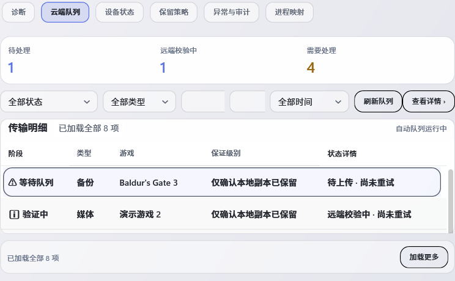
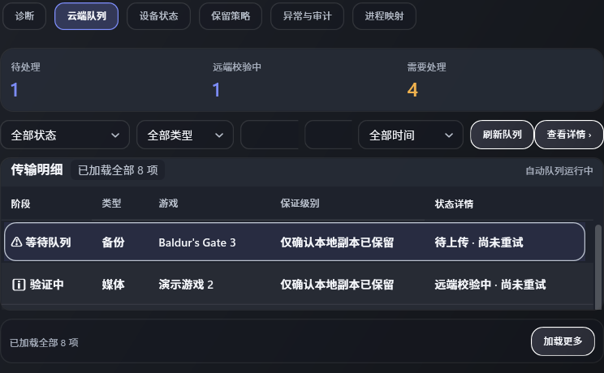

# 用户报告的辅助文字密度与状态色复核：云端队列摘要

日期：2026-09-30。本次处理是用户跨页面精简说明与主题色要求中的一个已核对实例；不代表完成 R03-02 或 R22-08 全组，也不改变 192 项任务状态。

## 修改

- Maintenance“云端队列”摘要卡移除三个始终占位的解释行。原文转为各自标题的 Tooltip 和 UI Automation HelpText；“远端校验只读、不覆盖本地存档”的安全说明仍可读取。
- “待处理”和“远端校验中”计数从信息蓝改用主题强调色 `GscAccentBrush`；“需要处理”继续使用警示色 `GscWarningBrush`。数字旁仍有明确文本标签，颜色不是唯一状态指示。
- 没有改动 DTO、服务调用、命令、队列过滤/重试或安全行为。

## 行为、几何和视觉证据

- 当前源码 HEAD 为 `9602bdf743e70be2823a6638c5f001e74e9f3ce6`；构建时包含本批两个未提交的 XAML/行为测试改动。Release solution build 成功，`0 warning / 0 error`，XAML 结构检查 `24/24`。
- 实际 `MaintenanceView` + 合成 `CloudTransferSummaryDto` 的 STA WPF 双主题用例 `1/1`。窗口尺寸 `1280×900 DIP`：待处理/校验/需处理计数 `3/2/1` 正确；三条解释都可从 Tooltip 和 UIA HelpText 读取；三张统计栏都只保留标题与计数两行；摘要卡实际高度断言在 `60–80 DIP`；前两项解析到主题强调色，需处理解析到警示色。TRX：[CloudTransferSummaryBehavior.trx](CloudTransferSummaryBehavior.trx)。
- 完整 `scripts/render-qa.ps1 -Configuration Release` 矩阵结果 `render-qa OK`。浅/深主题的生产 Maintenance 云端队列页为 `1040×700 DIP`；截图来自 OffscreenRenderHarness、逻辑 DPI `1.00`，不是 Playnite 或物理屏幕帧：

- `python scripts/validate-source.py` 和 `git diff --check` 通过。WPF 静态检查 `0 errors / 30 warnings / 177 info`，与既有仓库扫描总数一致，无新增 error。R00/R01 freshness `14/14 FRESH`，没有命中登记源路径；[检查输出](R00-R01-freshness.txt)。
- 当前测试程序集 ProductVersion `0.6.73+9602bdf743e70be2823a6638c5f001e74e9f3ce6`；SHA-256 `F08D4EA4689F54A8FC56875C45F2DC6FC90D57FD2DBF16341FB748B86FAA8020`；MVID `0053a594-ef48-402b-890a-e499cebfb466`。插件程序集 ProductVersion 相同；SHA-256 `D179FEBF04BF6D2C5E1C65FDEE18776196A938E594F1AD1ABB7B36944D1F8D3B`；MVID `a165d76b-2aca-4c38-aa1f-c469b4ca3916`。

## 设计依据与未验边界

- Windows 颜色指南建议用颜色建立层级、表达意义，并节制地突出重要元素；WCAG 要求不能只依赖颜色传递信息。本卡数字仍有可见类别标签，警示计数同时保留“需要处理”文本，符合这些方向：[Microsoft color guidance](https://learn.microsoft.com/en-us/windows/apps/design/signature-experiences/color)、[W3C WCAG 2.2 Use of Color](https://www.w3.org/WAI/WCAG22/Understanding/use-of-color)。
- 使用合成队列状态，没有调用云服务、上传/校验真实数据或修改用户存档。没有启动 Playnite、验证用户安装 DLL 或物理 125%/150% DPI；离屏截图只说明逻辑尺寸与主题回归。
