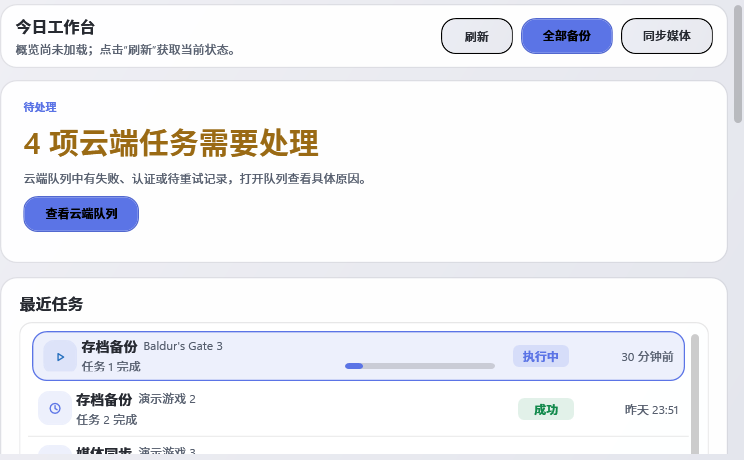
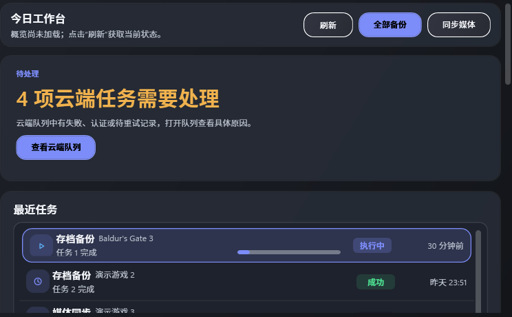

# 首页云端队列语义色复核

日期：2026-09-30。实现提交：`74ab0203f77b59ca4c36e749025884d7f2dcc253`（`统一首页云端队列状态颜色`）。本批是 Overview 的一个实例修正；不签收 R03-02/R22-08 全组，也不改变 192 项状态或计数。

## 修改与行为

- `OverviewCloudQueueValue` 是数量指标，改用主题强调色 `GscAccentBrush`。
- Overview 优先事项中的 Cloud 表示失败、认证或重试等待，标题改用默认警告色；Worker 错误仍用错误色、健康状态仍用成功色。
- 云端状态胶囊表达云端状态信息，保留 `GscInfoBrush`。打开队列的命令、说明文本、DTO 和服务行为均未改变。
- WPF 双主题生产视图行为 `2/2`。合成 `FailedCount=4` 下实测队列数字为 `4`、数字/优先标题/信息胶囊分别使用 accent/warning/info；`OpenCloudQueueCommand` 仍绑定到实际按钮。文字对比度（最低值，按管理游戏指标/队列数/注意标题顺序）为 Light `4.13/4.13/4.72:1`、Dark `4.77/4.77/7.66:1`。TRX：[OverviewCloudMetric.trx](OverviewCloudMetric.trx)。

## 验证和视觉

- 提交后的隔离 Release solution build：插件 `net462`、测试 `net472`，`0 warnings / 0 errors`；日志：[release-build.txt](release-build.txt)。XAML 结构 `24/24`，`python scripts/validate-source.py` 和 `git diff --check` 通过。
- `UiAuditSourceTests` `6/6` 通过：[UiAuditSourceTests.trx](UiAuditSourceTests.trx)。最终行为与审计 console 分别见[行为日志](overview-behavior-console.txt)、[审计日志](ui-audit-console.txt)；本轮这两次测试没有出现 `InvalidComObjectException` 清理噪声。
- 提交后完整 `scripts/render-qa.ps1 -Configuration Release` 矩阵通过，`WorkingTreeClean=True`、Light/Dark、离屏逻辑 DPI `1.00`；[报告摘要](render-qa-summary.txt)。Overview 1040×700 DIP 图像：

- R00/R01 evidence freshness：`14/14 FRESH`，没有匹配的登记源路径：[检查结果](R00-R01-freshness.txt)。
- 程序集基于同一 ProductVersion `0.6.73+74ab0203f77b59ca4c36e749025884d7f2dcc253`：
  - 插件 `GameSaveCenter.Playnite.dll`：SHA-256 `BE7C2A1BB2E31F5E63DB6BADD1AA930B2C55B356B0DB63D2B01C6412065FF804`；MVID `7c9e3d1f-de2e-4cad-8b6b-22c7096efede`。
  - 测试 `GameSaveCenter.Playnite.Tests.dll`：SHA-256 `FC561F9F7A96BEE28D54554D08BE637F2BCE1085E0BCE6781E6F7435710EC8BC`；MVID `55b74c5b-07e4-4b89-af34-d4cc402f4f06`。

配色职责按 Microsoft 关于用颜色表达层级/语义、克制强调色的指南，以及 WCAG 不单靠颜色表达信息的要求；页面文字仍明确标出云端、需处理及计数类别：[Microsoft color guidance](https://learn.microsoft.com/en-us/windows/apps/design/signature-experiences/color)、[W3C WCAG 2.2 Use of Color](https://www.w3.org/WAI/WCAG22/Understanding/use-of-color)。

使用合成队列状态，没有访问真实云端、用户存档或媒体。没有启动真实 Playnite，也没有验证用户安装 DLL、窗口化/DPI 或物理屏幕帧；RenderHarness 只证明离屏逻辑尺寸下的视觉回归。该结果不证明整个产品的 Info 色索引已经审完。
